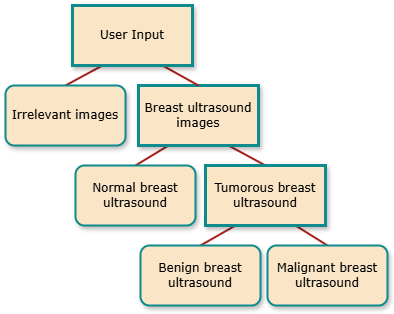
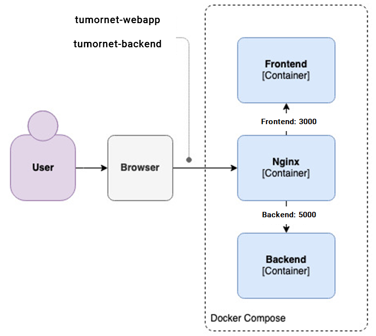

# TumorNet Documentation

## Overview
**TumorNet** is a web application designed for **breast tumor classification**, leveraging advanced **Artificial Intelligence** techniques. The application was developed as part of the thesis titled, ["Design and Implementation of a Web Application for Breast Tumor Classification through Convolutional Neural Networks"](https://polynoe.lib.uniwa.gr/xmlui/handle/11400/7182) and further enriched by the accompanying research paper, ["Evaluating Deep Learning Architectures for Breast Tumor Classification and Ultrasound Image Detection Using Transfer Learning"](https://www.mdpi.com/2504-2289/9/5/111). The primary objective of this project was to create an **open-source web application** capable of classifying breast ultrasound images. The system first determines whether an uploaded image is relevant for analysis, then identifies whether the image depicts normal or tumorous breast tissue. For images classified as tumorous, the system further distinguishes between benign and malignant tumors. This multi-step classification process is powered by a sequence of pre-trained deep learning models that were fine-tuned using comprehensive datasets.

The research focused on evaluating the effectiveness of **binary classification systems** over traditional three-class classification approaches. Although the results show that breaking the task into two stages—first distinguishing normal tissue from tumorous tissue, and then categorizing benign and malignant tumors—did not significantly improve accuracy, the sensitivity and F1 score metrics suggest that this architecture is more effective for the task. This approach has the potential to improve diagnostic accuracy and efficiency in clinical settings, enhancing the early detection of breast cancer and providing valuable support to medical professionals in delivering better patient care. The architecture of TumorNet, showcasing its backend workflow and system components, is illustrated in the image below:

<p align="center">
  
</p>

The live demonstration of the application can be accessed [here](https://tumornet.telsip.uniwa.gr/)

## Version
The current version of the application is **v2.1**. It has been optimized for minimal latency and fastest response times, with the application hosted on dedicated servers at the [TelSiP Research Laboratory](https://telsip.uniwa.gr/), University of West Attica, Athens, Greece.

## Technology Stack
### Model Development Environment
The software environment for model development was built on **Python 3.10.12**, utilizing **TensorFlow** and **Keras** as the primary frameworks for machine learning and deep learning. To support these frameworks, several auxiliary libraries were included: scikit-learn, Matplotlib, Seaborn, OpenCV, and Pillow. These libraries provided the necessary tools for data preprocessing, model evaluation, and visualization, ensuring a comprehensive and efficient workflow throughout the model development and experimentation process.

### Server-Side Framework
The server was developed using **Flask**, a lightweight **Python** web framework, which facilitated API creation and backend logic. Additional server-side dependencies and libraries are detailed in the [requirements.txt](tumornet-backend/requirements.txt) file for reproducibility and setup consistency.

### Frontend Framework
The frontend interface was developed with **React**, a modern **JavaScript** library for building user interfaces. For interactive and dynamic graph rendering, various React-compatible visualization libraries were integrated, ensuring a responsive and user-friendly data presentation.

## Frontend-Backend Communication
The communication between the **frontend** and **backend** of the application is streamlined through a single endpoint, ensuring efficient and secure data exchange.
When the user selects an image for analysis The frontend sends the image as a **base64 encoded message** to the backend using a `POST` request.

```javascript
 const handlePrediction = () => {
    setIsPredicting(true); // Set predicting state to true
    let message = {
      image: base64Image
    };

// Send data to server. Based on the port running the predict_app.py (Here is local host port 5000 /predict)
    fetch("http://127.0.0.1:5000/predict", {
      method: 'POST',
      body: JSON.stringify(message),
    })
      .then(response => response.json())
      .then(data => {
        setTimeout(() => {
          setPrediction(data); // Update prediction state to true
          console.log(data); //Print the prediction. Debugging purposes only
          setIsPredicting(false); // Update prediction state to false
        }, 3000);
      })
      .catch(error => {
        console.error('Error:', error);
        setIsPredicting(false); //If an error occurs set predicting state to false
      });
  };
```

Upon receiving the request, the backend decodes the message, preprocesses the image to prepare it for analysis, passes it through the models to generate a prediction, and constructs a structured response object as shown below.

```python
response = {
                'irrelevant': prediction1_list,
                'tumorous': prediction2_list,
                'malignant': prediction3_list
                }
```

### Nginx Integration for Secure Communication
As depicted in the diagram below, **Nginx** serves as an intermediary, routing requests between the frontend and backend containers to ensure secure and controlled communication. It enforces security by preventing unauthorized external access, ensuring that only the frontend can communicate with the backend.

<p align="center">
  
</p>

The communication flow is managed within a **Docker Compose** setup, ensuring secure and efficient interaction between the frontend and backend components.

## Cloning and Running TumorNet Locally
Before cloning the GitHub repository, ensure that the following are installed on your machine:

**Git**: For cloning the repository.
**Python 3.10.12** (or later): To run the project.
### Step 1: Clone the Repository
Clone the repository by running the following command:
```bash
git clone https://github.com/christopherkormpos/TumorNet.git
```
### Step 2: Install Dependencies
Navigate to the backend directory and install the required Python dependencies by executing:
```bash
pip install -r requirements.txt
```
### Step 3: Run the Backend
After the dependencies are installed, start the backend by running:
```bash
python predict_app.py
```
The backend server will be accessible at `localhost:5000`

### Step 4: Run the Frontend
To start the frontend, which runs on port **3000**, navigate to the frontend directory and execute:
```bash
npm install
npm start
```
The frontend will be accessible at `localhost:3000`

## Aknowledments
I would like to express my sincere gratitude to **Grigorios Koulouras** for his invaluable guidance, mentorship, and unwavering support as both my supervisor and co-writer of the paper; to PhD candidates **Fotios Zantalis** and **Stylianos Katsoulis** for their collaboration as co-writers, whose insightful contributions significantly enriched the research.

## Contact
If you encounter any issues or bugs with the application, or if you face difficulties while building the project locally, feel free to reach out to me:

- **Email**: christopher.kormpos@gmail.com and ckormpos@uniwa.gr
- **GitHub**: https://github.com/christopherkormpos
- **LinkedIn**: [LinkedIn Profile](https://www.linkedin.com/in/christopher-kormpos-27808b194/)

## License
This project is licensed under the MIT License - see the [LICENSE](LICENSE) file for details.
